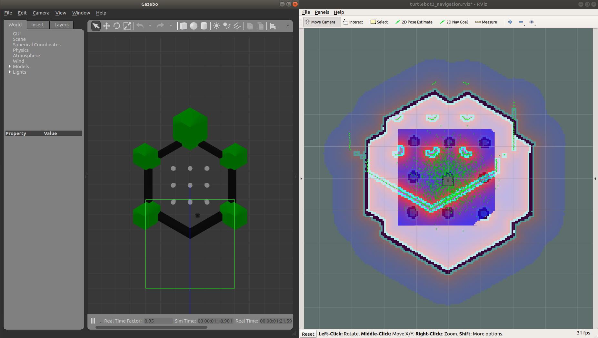
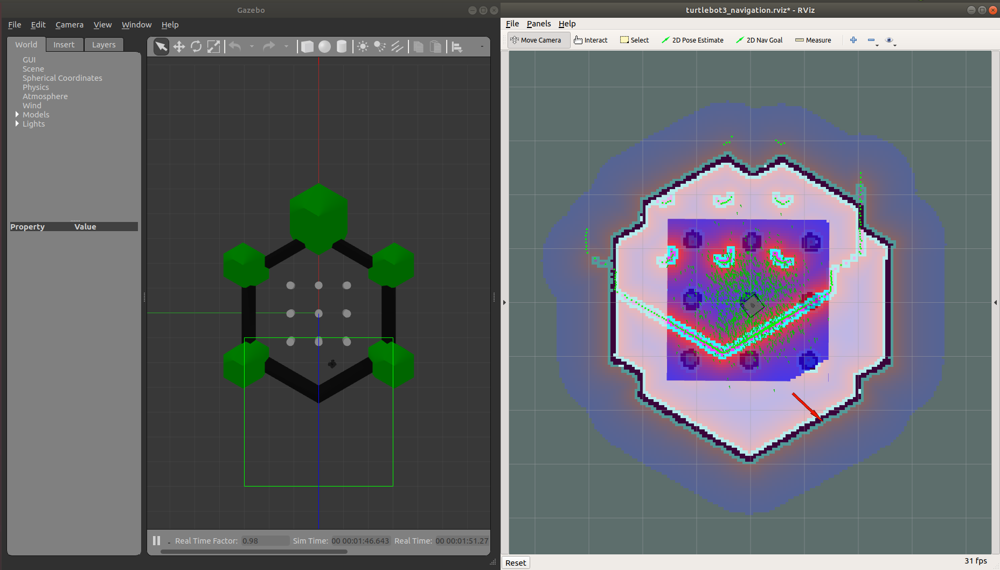

# error_resolution_diagnoser Documentation 

[](https://jenkins.cognicept.systems/job/cognicept-agent-pipeline/)  [](http://34.87.159.179:5000/coverage/cognicept-agent-pipeline)
[](https://opensource.org/licenses/BSD-3-Clause)
[](https://cognicept.systems)

**--------Disclaimer Start--------**

This particular branch has specific instructions and source code ported for Windows OS. If you are planning on using this on Linux, please switch to the `master` or `develop` branches. Thanks for checking this project out!

**--------Disclaimer End--------**


Hello there! Thanks for checking out the documentation. This particular document is a user's guide. If you are more interested in what the `error_resolution_diagnoser` is designed for, and the architecture, please take a look at the introduction document [here][7]!

This project adheres to the Contributor Covenant [code of conduct](CODE_OF_CONDUCT.md). By participating, you are expected to uphold this code. Please report unacceptable behavior to [info@cognicept.systems](mailto:info@cognicept.systems). If you are interested in contributing, please refer to the guidelines [here](CONTRIBUTING.md).  

- [Description](#description)
- [Overview](#overview)
- [Prerequisites](#prerequisites)
- [Installation](#installation)
    * [Building Natively](#building-natively)
    * [Building through Docker](#building-through-docker)
- [Running tests](#running-tests)
    * [Native](#native)
    * [Using Docker](#using-docker)
- [Syntax](#syntax)
    * [Configure and Run for native installations](#configure-and-run-for-native-installations)
    * [Configure and Run for Docker](#configure-and-run-for-docker)
- [Example-Application](#example-application)
    * [Catching Navigation Errors from /move_base](#catching-navigation-errors-from-/move_base)
    * [Start Simulation](#start-simulation)
    * [Start error_resolution_diagnoser](#start-error_resolution_diagnoser)
    * [Generate a navigation error](#generate-a-navigation-error)
    * [Generate diagnostic logs](#generate-diagnostic-logs)
        * [Log parsing](#log-parsing)
        * [Log publishing](#log-publishing)
- [Related-Pages](#related-pages)

## Description
This article explains how to run the  `error_resolution_diagnoser` ROS node. For the rest of the documentation, the term `agent` will be used as a shorthand to refer to the `error_resolution_diagnoser`.

## Overview
This article shows how to start the `error_resolution_diagnoser`. By the end of this, you will be able to start the agent, run a simulation and test the listener agent to listen to navigation errors.

## Prerequisites
Some knowledge of ROS and robotics is necessary.

## Installation

You can get access to the agent by cloning this repo. After this, there are a couple of choices as to how you want to build and run the agent ROS node. Either natively, or using Docker. Steps are as follows:

1. Open a terminal window.

2. Change to your `src` folder of the catkin workspace directory. Generally it is as follows:
    
        $ cd ~/catkin_ws/src
    
3. Clone the repo:
    
        $ git clone https://github.com/cognicept-admin/error_resolution_diagnoser
    
### Building natively:

You can use this approach if you are planning on running this on a system that has a working ROS installation. Steps are as follows:

1.  Install Microsoft's [`C++ REST SDK`][6] for establishing the backend api. For Windows OS, the latest version of this package at the time of the development of this project had some issues with respect to how platform dependent strings are handled. So instead of using this version, we need to use a public fork of the project where this issue has been addressed. To keep this document clean, please refer to [`CPPRESTSDK_INSTALL.md`](CPPRESTSDK_INSTALL.md) to see how to do the installation for the dependency and come back here!
    
2. Change to your `catkin_ws` folder:
    
        $ cd ..
     

3. Issue `catkin_make` to build the ROS node:
    
        $ catkin_make
    
4. Check if node has built correctly and registered using `rospack`:
    
        $ rospack list | grep error_resolution_diagnoser
        error_resolution_diagnoser /home/swaroophs/catkin_ws/src/error_resolution_diagnoser

5. Additionally, follow the appropriate installation steps for installing the `error_classification_server` [here][8].
    
That is it for the native installation! You can now jump to [Running tests](#running-tests) or [Syntax](#syntax).

### Building through Docker:

You can use this approach if you are planning on running the agent on a system that does not have ROS but will be connected to the same ROS network. 

1. First, make sure you have a working [Docker installation][6].

2. You can then build the `docker` image using `docker build` and the provided `Dockerfile`:

        $ docker build -t error_resolution_diagnoser .

3. Additionally, follow the appropriate installation steps for installing the `error_classification_server` [here][8].
    
That is it for the Docker installation! You can now jump to [Running tests](#running-tests) or [Syntax](#syntax).

## Running tests
Optionally, you can run the unit and integration tests natively or using Docker, based on the installation method you chose in the previous section. 

**NOTE: Before running tests, makes sure the `error_classification_server` is running either natively or using Docker. Take a look at the relevant documentation [here][9]. Failure to have the API server will result in some failed tests that require connection to ECS.**

### Native

1. Open a new terminal and switch to the `catkin_ws` directory:

        $ cd ~/catkin_ws
    
2. Run tests using `catkin_make run_tests` as shown below. Your terminal will show test results similar to the sample [here](#sample-test-results). Logs will be created in the `/$HOME/.cognicept/agent/logs` folder:

        $ catkin_make run_tests_error_resolution_diagnoser
    
### Using Docker

1. Make sure that you have built the docker image by following the steps [here](#building-through-docker).

2. Switch to the repository's folder or wherever you might be storing the `runtime.env` file.

        $ cd ~/catkin_ws/src/error_resolution_diagnoser
    
3. You can run the tests by using the following `docker run` command. Your terminal will show test results similar to the sample [here](#sample-test-results). Logs will be created in the `/$HOME/.cognicept/agent/logs` folder:

        $ docker run -it \
        --env-file runtime.env \
        --network=host \
        --name=agent  \
        --volume="${HOME}/.cognicept/agent/logs:/root/.cognicept/agent/logs" \
        error_resolution_diagnoser:latest  \
        catkin_make run_tests error_resolution_diagnoser
    
### Sample Test Results:
    
    .
    .
    .
    [==========] Running 5 tests from 1 test case.
    [----------] Global test environment set-up.
    [----------] 5 tests from RobotEventTestSuite
    [ RUN      ] RobotEventTestSuite.getLogTest
    [       OK ] RobotEventTestSuite.getLogTest (2 ms)
    [ RUN      ] RobotEventTestSuite.updateLogROSTest
    [       OK ] RobotEventTestSuite.updateLogROSTest (2 ms)
    [ RUN      ] RobotEventTestSuite.updateLogDBTest
    [       OK ] RobotEventTestSuite.updateLogDBTest (2 ms)
    [ RUN      ] RobotEventTestSuite.updateEventIdTest
    [       OK ] RobotEventTestSuite.updateEventIdTest (3 ms)
    [ RUN      ] RobotEventTestSuite.clearTest
    [       OK ] RobotEventTestSuite.clearTest (2 ms)
    [----------] 5 tests from RobotEventTestSuite (11 ms total)

    [----------] Global test environment tear-down
    [==========] 5 tests from 1 test case ran. (12 ms total)
    [  PASSED  ] 5 tests.
    .
    .
    .
    .
    [==========] Running 8 tests from 1 test case.
    [----------] Global test environment set-up.
    [----------] 8 tests from StateManagerTestSuite
    [ RUN      ] StateManagerTestSuite.existTest
    [       OK ] StateManagerTestSuite.existTest (0 ms)
    [ RUN      ] StateManagerTestSuite.checkErrorTest
    [       OK ] StateManagerTestSuite.checkErrorTest (0 ms)
    [ RUN      ] StateManagerTestSuite.checkWarningTest
    [       OK ] StateManagerTestSuite.checkWarningTest (0 ms)
    [ RUN      ] StateManagerTestSuite.checkInfoTest
    [       OK ] StateManagerTestSuite.checkInfoTest (0 ms)
    [ RUN      ] StateManagerTestSuite.checkMessageROSErrorTest
    8 level event logged with id: 2bbbd64a-1e46-4bc3-9da7-a256b1d71486
    /home/swaroophs/.cognicept/agent/logs/unittest_logs/logData1.json
    Checking: /home/swaroophs/.cognicept/agent/logs/unittest_logs/logData1.json
    8 level event logged with id: 8e751444-e079-408a-9170-fd9f6512869d
    /home/swaroophs/.cognicept/agent/logs/unittest_logs/logData2.json
    [       OK ] StateManagerTestSuite.checkMessageROSErrorTest (3 ms)
    [ RUN      ] StateManagerTestSuite.checkMessageROSWarningTest
    4 level event logged with id: e6896d26-8770-4d2a-a778-72db3b58c333
    /home/swaroophs/.cognicept/agent/logs/unittest_logs/logData3.json
    [       OK ] StateManagerTestSuite.checkMessageROSWarningTest (2 ms)
    [ RUN      ] StateManagerTestSuite.checkMessageROSInfoTest
    2 level event logged with id: c5961351-73ee-4698-93a5-6d165d282d24
    /home/swaroophs/.cognicept/agent/logs/unittest_logs/logData4.json
    2 level event logged with id: c5961351-73ee-4698-93a5-6d165d282d24
    /home/swaroophs/.cognicept/agent/logs/unittest_logs/logData5.json
    [       OK ] StateManagerTestSuite.checkMessageROSInfoTest (2 ms)
    [ RUN      ] StateManagerTestSuite.clearTest
    [       OK ] StateManagerTestSuite.clearTest (0 ms)
    [----------] 8 tests from StateManagerTestSuite (7 ms total)

    [----------] Global test environment tear-down
    [==========] 8 tests from 1 test case ran. (7 ms total)
    [  PASSED  ] 8 tests.
    .
    .
    .
    .
    [==========] Running 6 tests from 1 test case.
    [----------] Global test environment set-up.
    [----------] 6 tests from BackEndApiTestSuite
    [ RUN      ] BackEndApiTestSuite.pushTest
    8 level event logged with id: Sample id
    /home/swaroophs/.cognicept/agent/logs/unittest_logs/logData1.json
    [       OK ] BackEndApiTestSuite.pushTest (1 ms)
    [ RUN      ] BackEndApiTestSuite.jsonTest
    [       OK ] BackEndApiTestSuite.jsonTest (0 ms)
    [ RUN      ] BackEndApiTestSuite.statusTrueTest
    Status Logged: Online
    Checking: /home/swaroophs/.cognicept/agent/logs/unittest_logs/logDataStatus.json
    [       OK ] BackEndApiTestSuite.statusTrueTest (0 ms)
    [ RUN      ] BackEndApiTestSuite.statusFalseTest
    Status Logged: Offline
    Checking: /home/swaroophs/.cognicept/agent/logs/unittest_logs/logDataStatus.json
    [       OK ] BackEndApiTestSuite.statusFalseTest (0 ms)
    [ RUN      ] BackEndApiTestSuite.ecsHitTest
    [       OK ] BackEndApiTestSuite.ecsHitTest (43 ms)
    [ RUN      ] BackEndApiTestSuite.ecsMissTest
    [       OK ] BackEndApiTestSuite.ecsMissTest (15 ms)
    [----------] 6 tests from BackEndApiTestSuite (59 ms total)

    [----------] Global test environment tear-down
    [==========] 6 tests from 1 test case ran. (59 ms total)
    [  PASSED  ] 6 tests.
    .
    .
    .
    .
    [Testcase: testlisteneragent_test_node_ros] ... ok

    [ROSTEST]-----------------------------------------------------------------------

    [error_resolution_diagnoser.rosunit-listeneragent_test_node_ros/errorSuppressionTest][passed]
    [error_resolution_diagnoser.rosunit-listeneragent_test_node_ros/infoSuppressionTest][passed]
    [error_resolution_diagnoser.rosunit-listeneragent_test_node_ros/warningSuppressionTest][passed]

    SUMMARY
    * RESULT: SUCCESS
    * TESTS: 3
    * ERRORS: 0
    * FAILURES: 0
    .
    .
    .
    .
    [Testcase: testlisteneragent_test_node_db] ... ok

    [ROSTEST]-----------------------------------------------------------------------

    [error_resolution_diagnoser.rosunit-listeneragent_test_node_db/errorSuppressionTest][passed]
    [error_resolution_diagnoser.rosunit-listeneragent_test_node_db/infoSuppressionTest][passed]
    [error_resolution_diagnoser.rosunit-listeneragent_test_node_db/warningSuppressionTest][passed]
    [error_resolution_diagnoser.rosunit-listeneragent_test_node_db/compoundingErrorTest][passed]
    [error_resolution_diagnoser.rosunit-listeneragent_test_node_db/noncompoundingErrorTest][passed]

    SUMMARY
    * RESULT: SUCCESS
    * TESTS: 5
    * ERRORS: 0
    * FAILURES: 0
    .
    .
    .
    .
    [Testcase: testlisteneragent_test_node_telemetry] ... ok

    [ROSTEST]-----------------------------------------------------------------------

    [error_resolution_diagnoser.rosunit-listeneragent_test_node_telemetry/telemetryTest][passed]

    SUMMARY
    * RESULT: SUCCESS
    * TESTS: 1
    * ERRORS: 0
    * FAILURES: 0
    .
    .
    .
    .
    [Testcase: testlisteneragent_test_node_diagnostics] ... ok

    [ROSTEST]-----------------------------------------------------------------------

    [error_resolution_diagnoser.rosunit-listeneragent_test_node_diagnostics/diagnosticsNoStateChangeTest][passed]
    [error_resolution_diagnoser.rosunit-listeneragent_test_node_diagnostics/diagnosticsStateChangeTest][passed]

    SUMMARY
    * RESULT: SUCCESS
    * TESTS: 2
    * ERRORS: 0
    * FAILURES: 0


## Syntax
The agent can be configured using the following environment variables:

| Variable           | Type                                                                                                    |    Default     | Description                                                                                                                                                                                                                                                                                                                                                                                                                                                                                                                                                                          |
|--------------------|:--------------------------------------------------------------------------------------------------------|:--------------:|:-------------------------------------------------------------------------------------------------------------------------------------------------------------------------------------------------------------------------------------------------------------------------------------------------------------------------------------------------------------------------------------------------------------------------------------------------------------------------------------------------------------------------------------------------------------------------------------|
| `ROBOT_CODE`       | Any String                                                                                              | `"Undefined"`  | A unique code that identifies the robot the agent is listening to. Usually a UUID but any string will work.                                                                                                                                                                                                                                                                                                                                                                                                                                                                          |
| `SITE_CODE`        | Any String                                                                                              | `"Undefined"`  | A unique code that identifies the site of the robot being listened to. Usually a UUID but any string will work.                                                                                                                                                                                                                                                                                                                                                                                                                                                                      |
| `AGENT_ID`         | Any String                                                                                              | `"Undefined"`  | A unique code that identifies the agent itself. Usually a UUID but any string will work.                                                                                                                                                                                                                                                                                                                                                                                                                                                                                             |
| `AGENT_MODE`       | `JSON_TEST` or `POST_TEST`                                                                              |  `JSON_TEST`   | When set to value `JSON_TEST`, will save JSON logs locally on the file system under the `$HOME/.cognicept/agent/logs/< run_id >` folder. Where `< run_id >` is uniquely created every time the agent is launched.                                                                                                       When set to value `POST_TEST`, in addition to saving logs like the `JSON_TEST` mode, will also push the JSON to a REST API endpoint configured by the `AGENT_POST_API` variable.                                                                             |
| `AGENT_POST_API`   | REST API Endpoint String                                                                                | Not applicable | If the `AGENT_MODE` is set to `POST_TEST`, this variable MUST be configured to a valid REST API endpoint. If not specified, the agent will default back to `JSON_TEST` mode. If API endpoint is not available to connect, agent will error out.                                                                                                                                                                                                                                                                                                                                      |
| `AGENT_TYPE`       | `ROS` or `DB`                                                                                           |     `ROS`      | When set to `ROS`, the agent catches ANY ROS log that is published to /rosout. When set to `DB`, logs that are only available as part of the *Error Classification System (ECS)* will be considered for reporting, to enable log suppression for particular robots/sites. The ECS should be available for communicating at the REST API endpoint configured by the `ECS_API` variable.                                                                                                                                                                                               |
| `ECS_API`          | REST API Endpoint String                                                                                | Not applicable | If the `AGENT_TYPE` is set to `DB`, this variable MUST be configured to a valid REST API endpoint. If not specified, the agent will default back to `ROS` mode. If API endpoint is not available to connect, agent will error out.                                                                                                                                                                                                                                                                                                                                                   |
| `ECS_ROBOT_MODEL`  | Valid Robot Model                                                                                       | Not applicable | If the `AGENT_TYPE` is set to `DB`, this variable MUST be configured to a valid robot model. If not specified, the agent will default back to `ROS` mode. For ROS 1 navigation stack, just use `Turtlebot3`.                                                                                                                                                                                                                                                                                                                                                                         |
| `LOG_NODE_LIST`    | Semicolon separated list of ROS nodes to filter and listen to (precede node names with `/`)             | Not applicable | This is an optional parameter that can be used to specify a 'semi-colon' separated list of ROS node names for which alone the ROS logs will be filtered by. Use this parameter to selectively choose only nodes of choice to remove noise from the ROS logs. Especially if you do not have control over the ROS logs of some of the other nodes. When not specified, all ROS node logs will be processed. When both `LOG_NODE_LIST` and `LOG_NODE_EX_LIST` are specified, `LOG_NODE_LIST` takes precedence and `LOG_NODE_EX_LIST` is ignored.                                        |
| `LOG_NODE_EX_LIST` | Semicolon separated list of ROS node logs to filter OUT and NOT listen to (precede node names with `/`) | Not applicable | This is an optional parameter that can be used to specify a 'semi-colon' separated list of ROS node names for which the ROS logs will be filtered OUT and not listened to. Use this parameter to selectively exclude only nodes of choice to remove nodes that emit noisy and unnecessary ROS logs. Especially if you do not have control over the ROS logs of some of the other nodes. When not specified, all ROS node logs will be processed. When both `LOG_NODE_LIST` and `LOG_NODE_EX_LIST` are specified, `LOG_NODE_LIST` takes precedence and `LOG_NODE_EX_LIST` is ignored. |
| `DIAGNOSTICS`      | ON/OFF                                                                                                  |      OFF       | This will let the diagnoser listen to diagnostic information on the ROS node. By setting this to ON, the diagnoser will subscribe to `/diagnostics_agg` topic and report 'state-changes'. For more information, refer to the section [Generate diagnostic logs](#generate-diagnostic-logs).                                                                                                                                                                                                                                                                                          |

**NOTE: To run the agent in the `DB` mode, `error_classification_server` should be running either natively or using Docker. Take a look at the relevant documentation [here][9]. Failure to have the API server will result in the agent not able to find a valid API endpoint and result in an error thrown.**

Based on the type of installation, you can configure these variables by different methods as follows.

### Configure and Run for native installations
In case of a native installation, you can create them using the `export` command at the terminal. For e.g. here is an example set of parameters:

    $ export ROBOT_CODE=R2D2
    $ export SITE_CODE=MFALCON
    $ export AGENT_ID=DROID
    $ export AGENT_MODE=JSON_TEST
    $ export AGENT_TYPE=ROS


**Note: These values are available only in the current terminal and need to be recreated every time before running the listener. One way to get around this is to place these statements in the `bashrc` file**

Now, you can run the listener agent using the provided launch file and `roslaunch`:

    $ roslaunch error_resolution_diagnoser error_resolution_diagnoser.launch 

**NOTE: Just launching the ROS node will start a new ROS master if one is not found. If you would like to connect to a ROS network that is not localhost and has a different `ROS_IP` and `ROS_MASTER_URI`, specify these as environment variables as well. And use the `rosrun error_resolution_diagnoser error_resolution_diagnoser` run command instead.**

### Configure and Run for Docker
In case of a Docker installation, you can simply use the [`runtime.env`](runtime.env) file in this repository as an example template and pass it to the docker container with the `--env-file` argument when using the `docker run` command. Simply edit the `runtime.env` like a text file, or comment the unnecessary variables and then rerun the container. Example below:

    $ docker run -it \
    --env-file runtime.env \
    --network=host \
    --name=agent  \
    --volume="${HOME}/.cognicept/agent/logs:/root/.cognicept/agent/logs" \
    error_resolution_diagnoser:latest  \
    roslaunch error_resolution_diagnoser error_resolution_diagnoser.launch 

**NOTE: Just launching the ROS node will start a new ROS master if one is not found. If you would like to connect to a ROS network that is not localhost and has a different `ROS_IP` and `ROS_MASTER_URI`, specify these as environment variables as well. And use the `rosrun error_resolution_diagnoser error_resolution_diagnoser` run command instead.**

## Example Application

### Catching Navigation Errors from /move_base
In this example, we will run the agent along with the Turtlebot3 simulation to see how `/move_base` navigation errors are caught.

### Start Simulation
Start a Turtlebot3 Navigation demo as documented by Robotis [here][1]. Please make sure you have gone through the Turtlebot3 installation [documentation][2] if you are facing any errors with this step.

First, open a new terminal and launch the `turtlebot3_world`:

    $ export TURTLEBOT3_MODEL=waffle_pi
    $ roslaunch turtlebot3_gazebo turtlebot3_world.launch


Then, open a second terminal and launch the `turtlebot3_navigation` launch file:

    $ export TURTLEBOT3_MODEL=waffle_pi
    $ roslaunch turtlebot3_navigation turtlebot3_navigation.launch


At the end of this step, you would need to see something that looks like the following. Notice that the robot is mislocalized (i.e. the scan doesn't match the map) :



### Start error_resolution_diagnoser
We are ready to start listening to robot errors. Based on your installation type, you can start the agent in one of 2 ways:

**Running natively**

Simply launch the agent ROS node using the launch file:

    $ roslaunch error_resolution_diagnoser error_resolution_diagnoser.launch
    
**Running using Docker**

Run the following `docker run` command:

    $ docker run -it \
    --env-file runtime.env \
    --network=host \
    --name=agent  \
    --volume="${HOME}/.cognicept/agent/logs:/root/.cognicept/agent/logs" \
    error_resolution_diagnoser:latest  \
    roslaunch error_resolution_diagnoser error_resolution_diagnoser.launch 

 Apart from a few small differences, the agent prompts would look similar for both the types of launches. Sample is shown below:

    ... logging to /home/swaroophs/.ros/log/1d7d48ce-3603-11eb-9e94-9cb6d09cab4f/roslaunch-swarooph-xps-9963.log
    Checking log directory for disk usage. This may take a while.
    Press Ctrl-C to interrupt
    Done checking log file disk usage. Usage is <1GB.

    started roslaunch server http://swarooph-xps:43263/

    SUMMARY
    ========

    PARAMETERS
    * /rosdistro: melodic
    * /rosversion: 1.14.10

    NODES
    /
        error_resolution_diagnoser (error_resolution_diagnoser/error_resolution_diagnoser)

    auto-starting new master
    process[master]: started with pid [9973]
    ROS_MASTER_URI=http://localhost:11311

    setting /run_id to 1d7d48ce-3603-11eb-9e94-9cb6d09cab4f
    process[rosout-1]: started with pid [9984]
    started core service [/rosout]
    process[error_resolution_diagnoser-2]: started with pid [9987]
    =======================Environment variables setup======================
    AGENT_TYPE unspecified. Defaulting to ROS mode...
    ROBOT_CODE unspecified. Defaulting to 'Undefined'...
    SITE_CODE unspecified. Defaulting to 'Undefined'...
    AGENT_ID unspecified. Defaulting to 'Undefined'...
    AGENT_MODE unspecified. Defaulting to 'JSON_TEST'...
    LOG_NODE_LIST and LOG_NODE_EX_LIST unspecified. Defaulting to ALL nodes.
    DIAGNOSTICS is unspecified. Defaulting to OFF.
    ================================Other Info==============================
    ROS session detected
    Agent log directory created: /$HOME/.cognicept/agent/logs/1d7d48ce-3603-11eb-9e94-9cb6d09cab4f
    Updated latest log location in: /$HOME/.cognicept/agent/logs/latest_log_loc.txt
    TEST mode is ON. JSON Logs will be saved here: /$HOME/.cognicept/agent/logs/1d7d48ce-3603-11eb-9e94-9cb6d09cab4f
    ===========================Diagnosing Started===========================
    Status Logged: Online
    AGENT:: STATUS:: OK
    Status Logged: Online
    Status Logged: Online
    Status Logged: Online

Let's unpack what we see on the prompts here. First, we see the `Environment variables setup` section. Here, you can confirm the values of all the environment variables. It will also show if the agent is expecting a particular variable but it was not defined so a default value has been chosen. In our case, none of these variables have been explicitly defined, so the default values are used. If you are following along the documentation, you will see the environment variables as described in the [Configure and Run for native installations](#configure-and-run-for-native-installations) section or [Configure and Run for Docker](#configure-and-run-for-docker) section.

Next, we see the `Other Info` section:

    ================================Other Info==============================
    ROS session detected
    Agent log directory created: /$HOME/.cognicept/agent/logs/1d7d48ce-3603-11eb-9e94-9cb6d09cab4f
    Updated latest log location in: /$HOME/.cognicept/agent/logs/latest_log_loc.txt
    TEST mode is ON. JSON Logs will be saved here: /$HOME/.cognicept/agent/logs/1d7d48ce-3603-11eb-9e94-9cb6d09cab4f

If a ROS session is detected, the agent will query the `run_id` ROS parameter and then use it to create a folder under `$HOME/.cognicept/agent/logs/run_id` if one does not exist already. This will be where all the logs during a particular session will be stored. This location is also by default stored in a text file `$HOME/.cognicept/agent/logs/latest_log_loc.txt` so that non-ROS based systems can have easy access to the current logs. 

Next, we see the following:

    Status Logged: Online

The agent not only reports ROS logs such as ERROR, WARN and INFO but also generates *heartbeat* or *status* logs periodically which can be used to ascertain if an agent is "Online" or "Offline". This periodic status is updated every **15 seconds** (not tunable). The physical location of the log can be found at `$HOME/.cognicept/agent/logs/run_id/logDataStatus.json`. For e.g. a sample heartbeat log for Online status is shown below. The `telemetry` field has information from `/amcl_pose` and `/odom` topics if those topics are available. Note also that the timestamp is in `UTC`:

```JSON
{
    "agent_id": "Undefined",
    "compounding": "Null",
    "create_ticket": false,
    "description": "Null",
    "event_id": "Null",
    "level": "Heartbeat",
    "message": "Online",
    "module": "Status",
    "property_id": "Undefined",
    "resolution": "Null",
    "robot_id": "Undefined",
    "source": "Null",
    "telemetry": {
        "nav_pose": {
            "orientation": {
                "w": 0.99999884152124341,
                "x": 0,
                "y": 0,
                "z": 0.0015221551074446657
            },
            "position": {
                "x": -0.0094678079511700299,
                "y": 0.011611903529308352,
                "z": 0
            }
        },
        "odom_pose": {
            "orientation": {
                "w": 0.99999683187945687,
                "x": -4.7627278045892688e-06,
                "y": 0.0015896452518669405,
                "z": 0.0019517265021910678
            },
            "position": {
                "x": -1.9997808086051716,
                "y": -0.49937816109452193,
                "z": -0.0010073994756565584
            }
        }
    },
    "timestamp": "2020-07-07T07:16:12.233268"
}
```
If you keep the agent running, you should be able to see the `Status Logged: Online` prompt a few more times, once every 15 seconds.

### Generate a navigation error
Now, use `rviz` to provide a `2D Nav Goal` for the robot. 



Because the robot is mislocalized, chances are high that it will be unable to reach its goal, generating an error. When that happens, the terminal window running the simulation will show something like the following:

    [ WARN] [1594106498.021189262, 1340.793000000]: Clearing both costmaps to unstuck robot (3.00m).
    [ WARN] [1594106503.316184167, 1345.892000000]: Rotate recovery behavior started.
    [ INFO] [1594106510.070252314, 1352.392000000]: Got new plan
    [ INFO] [1594106510.287514428, 1352.592000000]: Got new plan
    [ INFO] [1594106510.505026824, 1352.793000000]: Got new plan
    [ INFO] [1594106510.717677277, 1352.992000000]: Got new plan
    [ INFO] [1594106510.924694606, 1353.192000000]: Got new plan
    [ INFO] [1594106511.135744718, 1353.392000000]: Got new plan
    [ INFO] [1594106511.341706025, 1353.592000000]: Got new plan
    [ INFO] [1594106511.556664476, 1353.792000000]: Got new plan
    [ INFO] [1594106511.774663014, 1353.994000000]: Got new plan
    [ INFO] [1594106511.985097664, 1354.192000000]: Got new plan
    [ INFO] [1594106512.195006825, 1354.392000000]: Got new plan
    [ INFO] [1594106512.413802299, 1354.593000000]: Got new plan
    [ INFO] [1594106512.639082203, 1354.793000000]: Got new plan
    [ INFO] [1594106512.859131651, 1354.992000000]: Got new plan
    [ INFO] [1594106513.075368175, 1355.192000000]: Got new plan
    [ INFO] [1594106513.494235832, 1355.592000000]: Got new plan
    [ WARN] [1594106515.697987963, 1357.712000000]: DWA planner failed to produce path.
    [ WARN] [1594106521.052841218, 1362.892000000]: Clearing both costmaps to unstuck robot (3.00m).
    [ WARN] [1594106526.792952897, 1368.092000000]: Rotate recovery behavior started.
    [ERROR] [1594106526.793536114, 1368.092000000]: Rotate recovery can't rotate in place because there is a potential collision. Cost: -1.00
    [ WARN] [1594106532.229535349, 1373.192000000]: Clearing both costmaps to unstuck robot (1.84m).
    [ WARN] [1594106537.649624458, 1378.392000000]: Rotate recovery behavior started.
    [ERROR] [1594106537.650356594, 1378.392000000]: Rotate recovery can't rotate in place because there is a potential collision. Cost: -1.00
    [ERROR] [1594106543.530244807, 1383.592000000]: Aborting because a valid plan could not be found. Even after executing all recovery behaviors


The terminal window running the agent will show the following. You can compare this with the prompts above and confirm that the agent is able to receive every message (and then some, since not ALL `rosout` logs are visible on the screen). After receiving, the agent decides to create a JSON log based on suppression logic as to whether that particular log has already been seen before. If it has, it suppresses it. For e.g. log is created only for the first `Got new plan`. The subsequent ones are suppressed. Once the agent receives a `Goal reached` message or message with with `ERROR` level, it resets the suppression logic and makes all logs available for reporting again. This can also be seen with the displayed `event_id` for each log reported. A message is eligible for suppression only within a particular event. And the `event_id` gets reset when the agent receives a `Goal reached` message or message with with `ERROR` level. For e.g. in the scenario below, we start with `event_id` `ac700f4f-c3ac-4553-9293-aa5658073391`. This id is maintained until the FIRST `ERROR` level message is reported when we get a new `event_id` `82e3a644-50ca-4955-ab53-e594faa50cb2`. Same goes for the last message which has a unique `event_id` all by itself `8197ef89-f72e-428d-8057-89cc0e3db054`, since the preceding message was also of level `ERROR`:

    Message received: Setting goal: Frame:map, Position(-2.185, -0.610, 0.000), Orientation(0.000, 0.000, 0.947, -0.321) = Angle: -2.489

    2 level event logged with id: ac700f4f-c3ac-4553-9293-aa5658073391
    /home/swaroophs/.cognicept/agent/logs/243d32d2-c01f-11ea-8f97-9cb6d09cab4f/logData1.json
    Message received: Clearing both costmaps to unstuck robot (3.00m).
    4 level event logged with id: ac700f4f-c3ac-4553-9293-aa5658073391
    /home/swaroophs/.cognicept/agent/logs/243d32d2-c01f-11ea-8f97-9cb6d09cab4f/logData2.json
    Status Logged: Online
    Message received: Rotate recovery behavior started.
    4 level event logged with id: ac700f4f-c3ac-4553-9293-aa5658073391
    /home/swaroophs/.cognicept/agent/logs/243d32d2-c01f-11ea-8f97-9cb6d09cab4f/logData3.json
    Message received: Got new plan
    2 level event logged with id: ac700f4f-c3ac-4553-9293-aa5658073391
    /home/swaroophs/.cognicept/agent/logs/243d32d2-c01f-11ea-8f97-9cb6d09cab4f/logData4.json
    Message received: Got new plan
    Message received: Got new plan
    Message received: Got new plan
    Message received: Got new plan
    Message received: Got new plan
    Message received: Got new plan
    Message received: Got new plan
    Message received: Got new plan
    Message received: Got new plan
    Message received: Got new plan
    Message received: Got new plan
    Message received: Got new plan
    Message received: Got new plan
    Message received: Got new plan
    Message received: Got new plan
    Message received: DWA planner failed to produce path.
    4 level event logged with id: ac700f4f-c3ac-4553-9293-aa5658073391
    /home/swaroophs/.cognicept/agent/logs/243d32d2-c01f-11ea-8f97-9cb6d09cab4f/logData5.json
    Status Logged: Online
    Message received: Clearing both costmaps to unstuck robot (3.00m).
    Message received: Rotate recovery behavior started.
    Message received: Rotate recovery can't rotate in place because there is a potential collision. Cost: -1.00
    8 level event logged with id: ac700f4f-c3ac-4553-9293-aa5658073391
    /home/swaroophs/.cognicept/agent/logs/243d32d2-c01f-11ea-8f97-9cb6d09cab4f/logData6.json
    Status Logged: Online
    Message received: Clearing both costmaps to unstuck robot (1.84m).
    4 level event logged with id: 82e3a644-50ca-4955-ab53-e594faa50cb2
    /home/swaroophs/.cognicept/agent/logs/243d32d2-c01f-11ea-8f97-9cb6d09cab4f/logData7.json
    Message received: Rotate recovery behavior started.
    4 level event logged with id: 82e3a644-50ca-4955-ab53-e594faa50cb2
    /home/swaroophs/.cognicept/agent/logs/243d32d2-c01f-11ea-8f97-9cb6d09cab4f/logData8.json
    Message received: Rotate recovery can't rotate in place because there is a potential collision. Cost: -1.00
    8 level event logged with id: 82e3a644-50ca-4955-ab53-e594faa50cb2
    /home/swaroophs/.cognicept/agent/logs/243d32d2-c01f-11ea-8f97-9cb6d09cab4f/logData9.json
    Message received: Aborting because a valid plan could not be found. Even after executing all recovery behaviors
    8 level event logged with id: 8197ef89-f72e-428d-8057-89cc0e3db054
    /home/swaroophs/.cognicept/agent/logs/243d32d2-c01f-11ea-8f97-9cb6d09cab4f/logData10.json

**NOTE: `Status Logged: Online` is still being logged concurrently to relay the heartbeat/status.**

Let's look at an example JSON event log, `logData10.json`. Note the `agent_id`, `robot_id` and `property_id` are `Undefined` since they were not set explicitly. If they are set, they will reflect here appropriately. `message` has information about the `rosout` actual message and a unique UUID `event_id`. This also has a flag `create_ticket` that can be used by downstream systems to trigger particular actions such as creating tickets or notifications:

```JSON
{
    "agent_id": "Undefined",
    "compounding": "Null",
    "create_ticket": true,
    "description": "Null",
    "event_id": "8197ef89-f72e-428d-8057-89cc0e3db054",
    "level": "8",
    "message": "Aborting because a valid plan could not be found. Even after executing all recovery behaviors",
    "module": "Null",
    "property_id": "Undefined",
    "resolution": "Null",
    "robot_id": "Undefined",
    "source": "/move_base",
    "telemetry": {
        "nav_pose": {
            "orientation": {
                "w": 0.82082055592865433,
                "x": 0,
                "y": 0,
                "z": -0.57118614738539908
            },
            "position": {
                "x": 0.15056330945205809,
                "y": -0.62967870987091601,
                "z": 0
            }
        },
        "odom_pose": {
            "orientation": {
                "w": -0.83107329061323598,
                "x": -0.00088346665627336374,
                "y": -0.0013226600148836588,
                "z": 0.55616063838286867
            },
            "position": {
                "x": -1.5099804830957191,
                "y": -0.95336694552114831,
                "z": -0.0010076925675013559
            }
        }
    },
    "timestamp": "2020-07-07T07:22:23.589385"
}
```

The `description`, `resolution` and `compounding` fields will be populated only when `AGENT_TYPE` is set to `DB` to provide some context to the errors. 

These JSON logs can be consumed by REST APIs/data streams to connect to incident management/monitoring systems to keep track of robot errors. To showcase this feature, let's use a sample REST API endpoint. Set the `AGENT_POST_API` variable to `https://postman-echo.com`. This is a test API where we can POST our JSON and receive a response for the POST request. Now when you re-run the agent, you will be able to see something similar to the following:

    Status Logged: Online
    Posting
    Pushing downstream...
    Response: {"args":{},"data":{"agent_id":"Undefined","compounding":"Null","create_ticket":false,"description":"Null","event_id":"Null","level":"Heartbeat","message":"Online","module":"Status","property_id":"Undefined","resolution":"Null","robot_id":"Undefined","source":"Null","telemetry":{"nav_pose":{"orientation":{"w":0.8208205559286543,"x":0,"y":0,"z":-0.5711861473853991},"position":{"x":0.1505633094520581,"y":-0.629678709870916,"z":0}},"odom_pose":{"orientation":{"w":-0.8886928803236448,"x":-0.0007289504086186572,"y":-0.0014158181483166026,"z":0.45850019471352105},"position":{"x":-1.5125549701444914,"y":-0.947599781078994,"z":-0.0010082941825314447}}},"timestamp":"2020-07-07T08:36:39.975229"},"files":{},"form":{},"headers":{"x-forwarded-proto":"https","x-forwarded-port":"443","host":"postman-echo.com","x-amzn-trace-id":"Root=1-5f043418-d87974782c3497f0c7d62698","content-length":"736","content-type":"application/json","user-agent":"cpprestsdk/2.10.2"},"json":{"agent_id":"Undefined","compounding":"Null","create_ticket":false,"description":"Null","event_id":"Null","level":"Heartbeat","message":"Online","module":"Status","property_id":"Undefined","resolution":"Null","robot_id":"Undefined","source":"Null","telemetry":{"nav_pose":{"orientation":{"w":0.8208205559286543,"x":0,"y":0,"z":-0.5711861473853991},"position":{"x":0.1505633094520581,"y":-0.629678709870916,"z":0}},"odom_pose":{"orientation":{"w":-0.8886928803236448,"x":-0.0007289504086186572,"y":-0.0014158181483166026,"z":0.45850019471352105},"position":{"x":-1.5125549701444914,"y":-0.947599781078994,"z":-0.0010082941825314447}}},"timestamp":"2020-07-07T08:36:39.975229"},"url":"https://postman-echo.com/post"}

From the echo, you are able to see that the response has the same contents as the JSON logs generated. Configure this endpoint appropriately to directly connect the agent to other systems such as incident management. Now, operators can monitor this incident management system to intervene robot operations to correct the errors to reduce downtime on the actual field.

### Generate diagnostic logs
The `error_resolution_diagnoser` supports logging `diagnostic_msgs/DiagnosticArray` type messages published to `/diagnostics_agg` topic in addition to the `rosgraph_msgs/Log` messages published to `/rosout_agg` topic. The support for diagnostics is slightly different from that of ROS logs. 

#### **Log parsing**
The diagnostic messages that come in are not directly processed by the diagnoser. It is first parsed into the following format. 

```
[(level)] (diagnostic_identifier)-->(diagnostic_message>)
```

This is because, every diagnostic message has a `level` that is published as shown [here][10]. The diagnoser includes this information in the `[(level)]` part of the log in a string form of `[ERROR]`, `[WARN]` or `[INFO]`. Optionally, the nodes also publish a `msg`. This information is included in the `(diagnostic_message)` part of the log. However this is not a requirement. A node might just publish the `level` noting the diagnostic status and not publish anything in the `msg`. Additionally, based on the type of node publishing, it also has identifiers such as `name` and `hardware_id`. The `(diagnostic_identifier)` part of the log is set to `name`, if it is available, otherwise `hardware_id` is used if that is available else set to an empty string if none is available.

#### **Log publishing**
The diagnoser then publishes the log by checking for *state changes* of the log. To give an example, here are the logs for a RoboSense lidar topic at the `[INFO]` and `[WARN]` levels.

```
[INFO] /Other/rslidar_node: rslidar_packets topic status-->Desired frequency met.
```

```
[WARN] /Other/rslidar_node: rslidar_packets topic status-->Frequency too low.
```

Since a majority of the diagnostic messages are published at a periodic interval, it is desirable to reduce the clutter by only publishing the state changes. i.e. publish logs only when log level for a node changes from `[INFO]` <--> `[WARN]` <--> `[ERROR]`. Another thing to note is, the error classification queries are done on the node names and levels rather than the messages which tend to be very dynamic. For example, the NVidia Jetson hardware has a ROS package called [`ros_jetson_stats`][11] that can help monitor the hardware diagnostics. One such diagnostic it publishes is the disk usage as follows.

```
[WARN] /jtop/board/disk-->23.1GB/27.4GB
```

```
[ERROR] /jtop/board/disk-->26.1GB/27.4GB
```

The node publishes disk usage message as UsedGB/AvailGB no matter the status level. And this might change based on the size of the drive installed. This makes it very dynamic in terms of adding logs. So the design choice was to make the the logging mechanism diagnostic message independent.

## Related Pages
For more related information, refer to:

* [error_classification_server Installation][8]
* [error_classification_server Syntax][9]
* [Virtual Navigation with Turtlebot3][1]
* [Turtlebot3 installing packages][2]
* [rosgraph_msgs documentation][3]
* [ROS logging documentation][4]
* [Microsoft C++ REST SDK][5]
* [Docker Installation][6]
* [Intro Document][7]
* [diagnostic_msgs documentation][10]
* [ros_jetson_stats repository][11]

[1]: http://emanual.robotis.com/docs/en/platform/turtlebot3/simulation/#virtual-navigation-with-turtlebot3
[2]: http://emanual.robotis.com/docs/en/platform/turtlebot3/pc_setup/#install-dependent-ros-packages
[3]: http://docs.ros.org/api/rosgraph_msgs/html/msg/Log.html
[4]: http://wiki.ros.org/roscpp/Overview/Logging
[5]: https://github.com/microsoft/cpprestsdk
[6]: https://docs.docker.com/engine/install/ubuntu/
[7]: docs/INTRO.md
[8]: https://github.com/cognicept-admin/error_classification_server#installation
[9]: https://github.com/cognicept-admin/error_classification_server#syntax
[10]: http://docs.ros.org/en/api/diagnostic_msgs/html/msg/DiagnosticStatus.html
[11]: https://github.com/rbonghi/ros_jetson_stats

## Acknowledgements
We would like to acknowledge the Singapore government for their vision and support to start this ambitious research and development project, *"Accelerating Open Source Technologies for Cross Domain Adoption through the Robot Operating System"*. The project is supported by Singapore National Robotics Programme (NRP).

Any opinions, findings and conclusions or recommendations expressed in this material are those of the author(s) and do not reflect the views of the NR2PO.